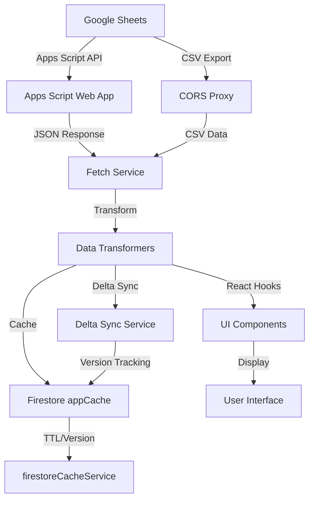
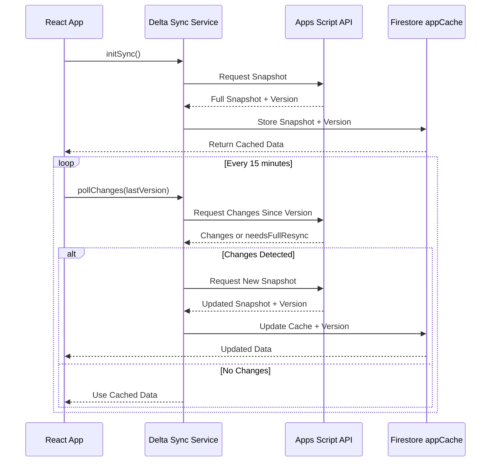
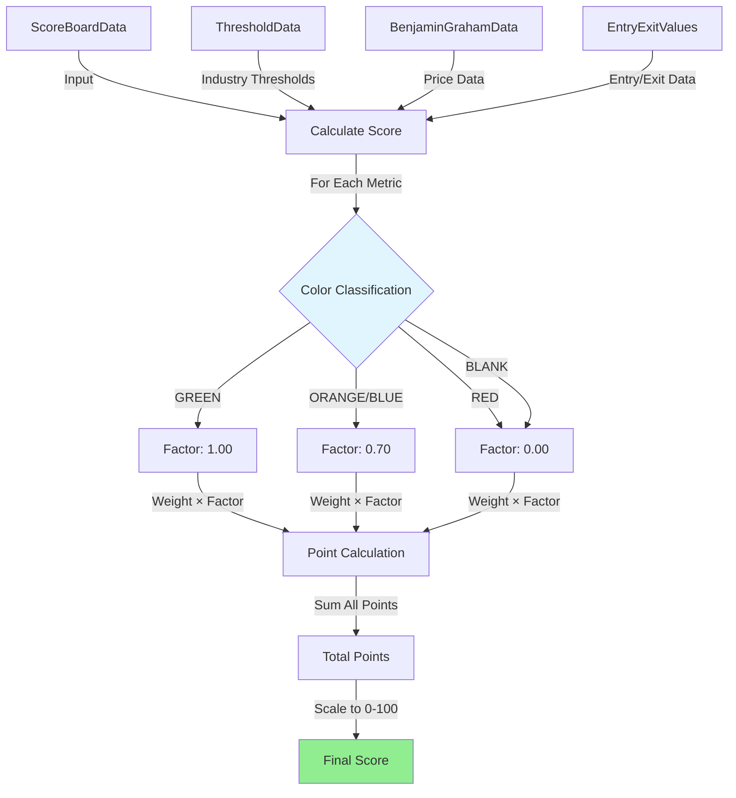
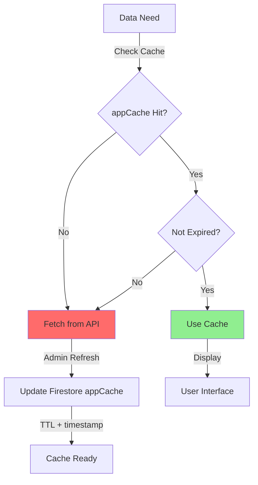
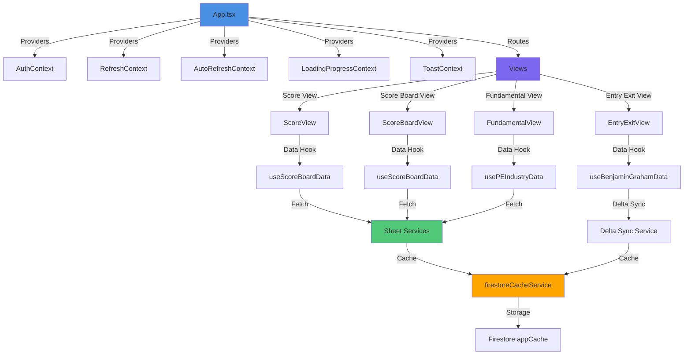
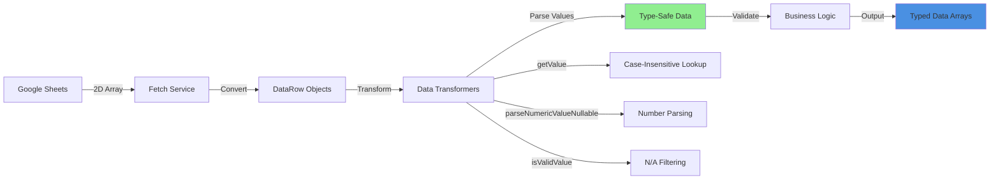

# Stock Score

En React-webbapplikation som hämtar stock score-data från Google Sheets och visar en dashboard med kategoriserade aktier baserat på score-trösklar.

**Repository:** [https://github.com/ABNAPP/STOCK-SCORE](https://github.com/ABNAPP/STOCK-SCORE)

## Funktioner

- 📊 Hämtar data från Google Sheets automatiskt via Google Apps Script API
- 🎯 Kategorisering av aktier baserat på score-trösklar
- 📈 Flera vyer för olika typer av analys (Score Board, Entry/Exit, P/E Industry, Threshold Industry)
- 🔄 Delta Sync support för effektivare datauppdateringar (endast ändringar istället för full reload)
- 🔐 Firebase Authentication med rollbaserad åtkomstkontroll (admin, editor, viewer1, viewer2)
- ⚙️ Anpassningsbara inställningar (trösklar, auto-uppdatering)
- 🔔 Browser notifications support
- 🌐 Internationalisering (i18n) - stöd för svenska och engelska
- 🎨 Modern, responsiv design med Tailwind CSS
- 📱 Fullständigt responsivt för mobil, tablet och desktop
- ♿ Tillgänglighetsfunktioner (WCAG-kompatibel)
- 🔍 Avancerad filtrering och sökning i tabeller
- 📊 Metadata-system för att visa datakällor, formler och villkor för varje kolumn

## Installation

```bash
npm install
```

## Utveckling

```bash
npm run dev
```

## Bygga för produktion

```bash
npm run build
```

## Deployment på Vercel

1. Pusha koden till GitHub
2. Importera projektet i Vercel
3. Vercel kommer automatiskt att detektera Vite-projektet
4. Deploy!

## Konfiguration

### Datahämtning (Primär metod: Google Apps Script API)

Appen använder **Google Apps Script API** som primär metod för datahämtning, vilket ger **5-10x snabbare prestanda** än CSV-proxy-metoden. CSV-proxy används endast som fallback om Apps Script API inte är konfigurerat.

#### Aktivera Apps Script API (Rekommenderat)

1. **För lokal utveckling:**
   - Kopiera `env.template` till `.env.local`: `cp env.template .env.local`
   - Öppna `.env.local` och ersätt placeholders med dina värden (se `docs/SECRETS.md` för instruktioner)
   - Lägg till:
     ```
     VITE_APPS_SCRIPT_URL=https://script.google.com/macros/s/YOUR_SCRIPT_ID/exec
     VITE_DELTA_SYNC_ENABLED=true
     VITE_DELTA_SYNC_POLL_MINUTES=15
     ```
   - Starta om utvecklingsservern: `npm run dev`

2. **För produktion (Vercel):**
   - Gå till Vercel Dashboard → Ditt Projekt → Settings → Environment Variables
   - Lägg till: `VITE_APPS_SCRIPT_URL` med din Apps Script Web App URL
   - Välj alla miljöer (Production, Preview, Development)
   - Spara och **REDEPLOY** projektet (viktigt!)

#### Delta Sync (Valfritt men rekommenderat)

Appen stödjer **Delta Sync** för effektivare datauppdateringar:
- Första gången: Hämtar full snapshot av all data
- Därefter: Hämtar endast ändringar (delta) baserat på poll-intervall
- Uppdaterar UI inkrementellt utan full sid-reload

Delta-sync är aktiverat som standard. Se `APPS_SCRIPT_SETUP.md` för detaljerad setup-instruktioner.

#### Fallback till CSV-proxy

Om `VITE_APPS_SCRIPT_URL` inte är konfigurerad, använder appen automatiskt CSV-proxy-metoden som fallback (långsammare men fungerar utan ytterligare konfiguration).

### Firebase Authentication

Appen använder Firebase Authentication för användarautentisering och rollbaserad åtkomstkontroll. Se `SET_ADMIN_ROLE.md` för instruktioner om att sätta admin-roll.

### Dokumentation

- `env.template` - Mall för environment variables (kopiera till `.env.local`)
- `docs/SECURITY.md` - Token policy och säkerhet
- `docs/SECRETS.md` - Hur man sätter nycklar lokalt och secret scan
- `APPS_SCRIPT_SETUP.md` - Detaljerad guide för att sätta upp Google Apps Script
- `SETUP_APPS_SCRIPT.md` / `QUICK_FIX.md` - Snabb guide för att konfigurera Apps Script URL
- `SET_ADMIN_ROLE.md` - Guide för att sätta admin-roll på användare
- `CLOUD_FUNCTIONS_SETUP.md` - Guide för Cloud Functions (valfritt)

## Arkitektur

### Data Flow

Appen använder en flerstegs data pipeline för att hämta och hantera data från Google Sheets:



### Delta Sync Flow

Delta sync möjliggör effektiva inkrementella uppdateringar:



### Score Calculation Flow

Score-beräkningen använder en viktad algoritm med färgklassificering:



### Cache Strategy

Data-cache hanteras i **Firestore appCache** (collection `appCache`). Admin uppdaterar cachen via Refresh Now; viewers läser endast whitelistade nycklar (scoreBoard, benjaminGraham, peIndustry, sma, currency_rates_usd). TTL och timestamp styr freshness; ingen localStorage används för data-cache. Offline-visning bygger på Firestore (ev. persistence) och UI (t.ex. OfflineIndicator), inte på localStorage-data-cache. För verifiering och offline-checklist, se [docs/CACHE_OFFLINE.md](docs/CACHE_OFFLINE.md). Auditpunkt 3.3 (localStorage data-cache) är N/A — design är Firestore som enda data-cache.



**Service Worker:** SW cachar endast static assets (app shell). API-anrop (Apps Script, proxies) går igenom SW utan caching (pass-through); all data-konsistens kommer från Firestore appCache.

### Component Architecture

Appen följer en hierarkisk komponentstruktur med context providers:



### Data Transformation Pipeline

Data från Google Sheets transformeras genom flera steg:



