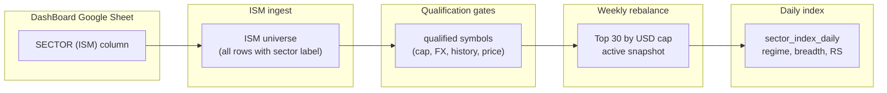

# From DashBoard sheet to ISM sector index constituents

This document explains why a company can appear on the **DashBoard** with a **SECTOR (ISM)** label but **not** show up in the ISM Posture **constituent basket** or sector index.

## Pipeline overview



| Stage | What it means | Example: Mining |
|-------|----------------|-----------------|
| **Sheet row** | `SECTOR (ISM)` set on DashBoard | ~39 companies |
| **ISM universe** | Same rows after ingest (`sectorIsm`) | 39 detected |
| **Qualified** | Passes all gates in `computeIsmRebalanceRowMetrics` | Often much fewer |
| **Basket** | Top 30 qualified by `market_cap_usd` in active rebalance snapshot | 0–30 (stored in Firestore) |
| **Sector index daily** | Official posture metrics; basket drives index level | Uses basket constituents |

**Important:** The constituent table in **ISM Posture → sector detail** reads the **active weekly rebalance snapshot** (`sector_rebalances/{sectorId}/snapshots`), not the sheet directly.

## Sheet-side requirements (ingest)

From [`mergeIsmIngestFromDashboardRows`](../src/services/ism/mergeIsmIngest.ts):

- **Company name** and **ticker** must be present.
- **`SECTOR (ISM)`** is the only column used for `sectorIsm` (the legacy **Industry** column is ignored for ISM).
- **Market cap** and **date of update** are quality hints; missing values flag ingest issues but do not by themselves remove a row from the universe.

Column aliases: [`dashboardSheetContract.ts`](../src/services/sheets/dashboardSheetContract.ts).

## Basket qualification gates

A symbol is **`qualified`** for the weekly basket only when **all** of the following hold ([`ismRebalanceRowMetrics.ts`](../src/services/ism/rebalance/ismRebalanceRowMetrics.ts)):

| Gate | Source |
|------|--------|
| Valid ticker identity | DashBoard ticker parse |
| Entry/Exit row + listing currency + FX → USD | Firestore `entiryExit` + currency rates |
| Market cap > 0, USD cap computed | DashBoard cap × FX |
| Price data signal | Fetch engine and/or EOD cache |
| ≥ 300 days history | `ISM_MIN_HISTORY_DAYS_FOR_QUALIFIED` |
| No `needs_review` flags | Symbol doc review codes |
| No API failure | Fetch engine blocked / high failure count |

Ranking: qualified symbols sorted by **`market_cap_usd` descending**, then **top 30** ([`computeWeeklySectorRebalance.ts`](../src/services/ism/rebalance/computeWeeklySectorRebalance.ts), `ISM_FULL_COVERAGE_TARGET`).

Common exclusion buckets recorded on the snapshot:

- `currency_or_fx` — missing Entry/Exit currency or no FX to USD
- `missing_price_data` — no usable price / history signal
- `insufficient_history` — fewer than 300 days
- `temporary_api_failure` — fetch engine blocked or repeated failures
- `market_cap` — missing or invalid cap on sheet
- `identity` / `needs_review` — ticker or mapping issues

## Firestore collections

| Collection | Role |
|------------|------|
| `symbols/{symbolId}` | Per-symbol discovery status, cap USD, history days |
| `eodAdjustedDaily/{eodSymbol}` | Adjusted EOD bars (warm path for history overlay) |
| `sector_rebalances/{sectorId}/snapshots/{date}` | Weekly basket; one doc marked `is_active: true` |
| `sector_index_daily/{sectorId}_{tradeDate}` | Official daily sector index row |

On-demand refresh (detail UI): [`refreshSectorRebalanceSnapshotOnDemand`](../src/services/ism/rebalance/refreshSectorRebalanceSnapshot.ts) merges EOD cache span into fetch-engine state before recomputing qualification.

## Analyze script

Run from repo root:

```bash
# Sheet-only report (all sectors)
npm run analyze:ism-candidates

# Sheet + Firestore basket diagnostics for one sector
npm run build --prefix functions
npm run analyze:ism-candidates -- --sector Mining

# Same, with output file
npm run analyze:ism-candidates -- --sector Mining --out docs/ism-mining-analysis.md

# JSON (includes constituentDiagnostics when --sector is set)
npm run analyze:ism-candidates -- --json --sector Mining

# Sheet report only (no ADC / Firestore)
npm run analyze:ism-candidates -- --sector Mining --skip-firestore
```

Requires **Application Default Credentials** for Firestore (`gcloud auth application-default login` or `GOOGLE_APPLICATION_CREDENTIALS`).

With `--sector`, the report adds an **EOD price history** summary and a per-row table:

| Column | Meaning |
|--------|---------|
| **EOD id** | Firestore doc id (`eodAdjustedDaily/{eodSymbol}`) |
| **EOD doc** | `yes` / `no` / `stale_gen` (generation mismatch vs `system/eodAdjustedCache`) |
| **Bars** | Adjusted-close bars in the ISM 5-year window |
| **Win days** | Calendar span of those bars |
| **Range d** | Inclusive days on the doc’s stored `range` |
| **Last bar** | `lastBarDate` on the cache doc |
| **Hist eff** | Effective history days (symbol doc + EOD overlay, same idea as refresh rebalance) |
| **Hist OK** | `yes` if **Hist eff** ≥ 300 |

Shortcut that builds functions first:

```bash
npm run analyze:ism-candidates:firestore -- --sector Mining
```

## Improving coverage

1. Fill **SECTOR (ISM)** on the sheet for names that should be in the universe.
2. Ensure **Entry/Exit currency** exists for each ticker (USD cap conversion).
3. Run **ISM fetch / debug sync** so symbol docs reach `qualified` (history bootstrap).
4. Warm **EOD adjusted cache** (`eodAdjustedDaily` nightly job or local cache script).
5. On **ISM Posture → sector detail**, use **refresh rebalance** to recompute the active snapshot with current data.

## Related docs

- [ISM Posture & Positioning](ism-posture-positioning.md)
- [DashBoard sheet contract](dashboard-sheet-contract.md)
- [ISM Mining companies roster](ism-mining-companies.md) (manual table; refresh from script output)
